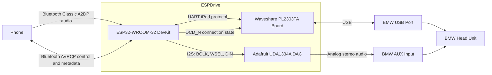

# ESPDrive Hardware Setup

## Status

This document describes the currently planned **ESPDrive prototype hardware**.

The first version is a **non-CAN-bus implementation**. It uses the BMW USB/iPod interface for control and metadata communication, while the actual audio signal is sent separately through the vehicle's analog AUX input.

## System Purpose

ESPDrive acts as a Bluetooth-to-BMW media adapter:

- A phone connects to the ESP32 through Bluetooth Classic.
- The ESP32 receives stereo audio through Bluetooth A2DP.
- The ESP32 exposes playback control and metadata through AVRCP.
- The ESP32 emulates the required iPod-side serial protocol toward the BMW.
- A UDA1334A DAC converts the ESP32 I2S audio stream into analog stereo audio.
- A PL2303TA USB-to-UART controller provides the BMW-facing USB connection.
- No CAN-bus connection is required for the first version.

## Planned Hardware

### 1. ESP32-WROOM-32 Development Board

Current planned board:

- **ESP32-WROOM-32 DevKit V1 / NodeMCU-32S**

Responsibilities:

- Bluetooth Classic A2DP audio receiver
- AVRCP playback control and metadata handling
- iPod protocol emulation
- UART communication with the PL2303TA
- I2S audio output to the UDA1334A
- Generation of the PL2303TA DCD_N status signal

### 2. Adafruit UDA1334A I2S Stereo DAC

Current planned board:

- **Adafruit I2S Stereo Decoder UDA1334A Breakout**
- Adafruit product ID: **3678**

Responsibilities:

- Receive digital stereo audio from the ESP32 over I2S
- Convert the I2S stream into analog left and right audio
- Feed the resulting analog stereo signal into the BMW AUX input

### 3. Waveshare PL2303 USB-UART Board

Current planned board:

- **Waveshare PL2303 USB UART Board (micro)**
- Waveshare model: **11315**
- USB-UART controller: **PL2303TA**

Responsibilities:

- Appear as the USB-side serial device connected to the BMW
- Carry iPod-protocol serial traffic between the BMW and the ESP32
- Report the emulated connection state through the PL2303TA DCD_N input

## High-Level Architecture



## ESP32 Pin Assignment

| ESP32 pin | Direction relative to ESP32 | Connected device | Device signal | Purpose |
|---|---:|---|---|---|
| GPIO16 / RX2 | Input | PL2303TA board | TXD | Receive serial data from the BMW-facing PL2303TA |
| GPIO17 / TX2 | Output | PL2303TA board | RXD | Send serial data to the BMW-facing PL2303TA |
| GPIO5 | Output | PL2303TA chip | DCD_N, physical pin 10 | Emulate the active-low connection/ready state |
| GPIO25 | Output | UDA1334A | WSEL / LRCLK | I2S left/right word selection |
| GPIO26 | Output | UDA1334A | DIN | I2S audio data |
| GPIO27 | Output | UDA1334A | BCLK | I2S bit clock |
| GND | — | All boards | GND | Common electrical reference |

## PL2303TA Wiring

| PL2303TA signal | Connection |
|---|---|
| TXD | ESP32 GPIO16 / RX2 |
| RXD | ESP32 GPIO17 / TX2 |
| GND | ESP32 GND and common system ground |
| VCCIO | 3.3 V logic level |
| DCD_N | ESP32 GPIO5 |
| USB | BMW USB port |

### DCD_N Board Modification

The Waveshare 11315 board does **not** expose DCD_N on its normal headers.

The required signal is located directly on the PL2303TA:

- Signal: **DCD_N**
- Package pin: **pin 10**
- Logic: **active low**
- Source: **ESP32 GPIO5**

The current plan therefore requires a permanent fine-wire connection to PL2303TA pin 10, or to a verified trace or via electrically connected to that pin.

DCD_N is only a one-bit status signal. It does not carry:

- Audio
- Menu information
- Track metadata
- Button events
- General iPod-protocol data

All regular protocol data is carried through the UART TXD and RXD lines.

## UDA1334A Wiring

| UDA1334A signal | ESP32 connection | Purpose |
|---|---|---|
| BCLK | GPIO27 | I2S bit clock |
| WSEL / LRCLK | GPIO25 | Left/right channel selection |
| DIN | GPIO26 | Digital stereo audio data |
| GND | Common GND | Electrical reference |
| Left analog output | BMW AUX left channel | Analog audio |
| Right analog output | BMW AUX right channel | Analog audio |
| Audio ground | BMW AUX ground and common GND | Analog audio reference |

The UDA1334A is used only for audio. It is not involved in USB communication or iPod protocol emulation.

## Power Arrangement

### Initial Prototype

The currently planned early-test power arrangement is:

- The BMW USB port powers the Waveshare PL2303TA board.
- The ESP32 is powered separately during initial development and testing.
- The UDA1334A is powered from the ESP32-side supply.
- The ESP32, UDA1334A, PL2303TA, USB ground, and AUX ground must share a common ground reference.

### Final Integrated Power

The final single-supply power implementation has not yet been fixed.

The hardware documentation must therefore not assume that the BMW USB port will directly power the ESP32 in the finished version. That decision remains pending until the USB current availability, startup behavior, noise, and grounding have been validated in the vehicle.

## Signal Paths

### Audio Path

```text
Phone
  -> Bluetooth Classic A2DP
  -> ESP32
  -> I2S
  -> UDA1334A
  -> Analog stereo
  -> BMW AUX input
```

### Control and Metadata Path

```text
BMW USB/iPod interface
  <-> USB
  <-> PL2303TA
  <-> UART
  <-> ESP32 iPod emulation
  <-> Bluetooth AVRCP
  <-> Phone
```

### Connection-State Path

```text
ESP32 GPIO5
  -> PL2303TA DCD_N pin 10
  -> USB modem-status notification
  -> BMW USB host
```

## Grounding Requirements

All participating circuits require a common reference:

- ESP32 ground
- UDA1334A ground
- PL2303TA ground
- BMW USB ground
- BMW AUX ground

The AUX ground and USB ground must not be treated as unrelated isolated grounds in this prototype.

Ground-loop noise remains a vehicle-integration concern and must be evaluated after the basic prototype is functional.

## Current Functional Scope

The current hardware is intended to support:

- Bluetooth audio playback
- BMW steering-wheel or head-unit playback commands routed through the iPod interface
- Track metadata presentation through the emulated iPod interface
- A small menu represented through iPod browsing structures
- Pairing and reconnection control
- No CAN-bus integration

The first planned menu includes:

- Status
- Pair new phone
- Reconnect last phone
- Disconnect
- Autoplay on/off
- Clear pairings
- Restart

These menu entries are implemented in firmware. They do not require additional physical buttons or displays.

## Explicitly Outside the First Hardware Version

The following are not part of the current prototype:

- CAN-bus transceiver
- Direct CAN-bus connection
- LIN-bus interface
- Dedicated physical display
- Dedicated physical buttons
- Custom PCB
- Integrated production-grade power supply
- Galvanic audio isolation
- Final enclosure

## Confirmed Versus Pending

### Confirmed

- ESP32-WROOM-32 DevKit V1 / NodeMCU-32S
- Adafruit UDA1334A breakout, product 3678
- Waveshare PL2303 USB UART Board (micro), model 11315
- Bluetooth Classic A2DP and AVRCP
- UART on GPIO16 and GPIO17
- I2S on GPIO25, GPIO26, and GPIO27
- GPIO5 driving PL2303TA DCD_N
- DCD_N access through PL2303TA pin 10
- Analog audio through BMW AUX
- Control and metadata through BMW USB
- No CAN bus in the first version

### Pending Validation or Final Design

- Exact permanent connection method to PL2303TA pin 10
- Final integrated ESP32 power source
- Vehicle noise and ground-loop behavior
- Final enclosure and strain relief
- Whether a custom PCB will replace the development boards later
- Exact BMW/iPod protocol behavior required by the target head unit

## Implementation Constraint

Firmware and wiring must preserve the separation between the two main paths:

1. **Audio is carried through ESP32 I2S, the UDA1334A, and BMW AUX.**
2. **Control, metadata, and emulated iPod communication are carried through UART, the PL2303TA, and BMW USB.**

The PL2303TA is not an audio device in this design, and the UDA1334A is not involved in USB or control communication.
